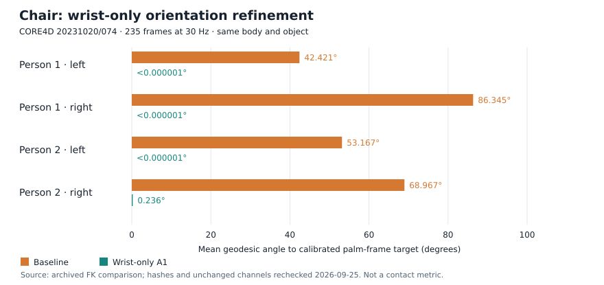

# 重定向方法对照：腕部优化与求解阶段核查

更新：2026-09-25。本文件是[实验台账](../../DEMO_AND_EXPERIMENT_INVENTORY.md)的专项材料，
不是新路线图，也不是论文正文。使用已有参考、原始报告和离线数值检查；未调用优化器、
未做动力学步进、未训练、未替换参考或启动Viser服务。

## 1. 本轮整理结果

- **椅子是腕部方法的首选对照。** 输入、身体、物体和时间轴完全相同，仅每台机器人左右腕共6个关节变化。
  四手平均掌框架朝向误差由62.725°降至0.059°，支持“补足关键点重定向的末端方向约束”。
- **桶与OMOMO提供跨数据补充。** 均已核对严格六腕配对；方向改善与碰撞几何/连续性变化分开记录。
- **已有小桌同原尺寸目标的单阶段/两阶段材料。** 共同前140帧可做已记录pipeline整体比较，
  但约束和先验设置也不同，不能单独归因为阶段数。140帧是命令上限，不是已知求解失败。
- **训练用的小桌是Stage1缩小场景的导出。** 不能把它的观感或训练结果，直接当成Stage2优于单阶段的证据。

交付：[结构化指标与哈希](retarget_method_comparison_20260925.json)、
[椅子朝向误差图](assets/chair_wrist_orientation_20260925.svg)。
相同相机的机器人截图/视频仍放在下一阶段制作；本文已列出输入、帧段和查看命令。

## 2. 腕部对照到底控制了什么

| 对照ID | 基准与结果 | 时间轴 | 本轮核对的相同条件 |
|---|---|---|---|
| W-CHAIR | [shared-small baseline](../../logs/Core4DPreviews/chair021_20231020_074_baseline_20260908/shared_small_preview/core4d_pair_reference.npz) → [A1](../../logs/Core4DPreviews/chair021_20231020_074_baseline_20260908/shared_small_a1_preview_tol6/core4d_pair_reference.npz) | 235帧、30Hz，0–234 | 非腕qpos、物体轨迹、共享尺度逐值相同；物体URDF字节相同 |
| W-BUCKET | [原尺寸two-stage](../../logs/Core4DPreviews/bucket003_20231020_071_20260918/two_stage/core4d_pair_reference.npz) → [wrist-only A1](../../logs/Core4DPreviews/bucket003_20231020_071_20260918/a1_wrist_only/core4d_pair_reference.npz) | 299帧、30Hz，0–298 | 非腕qpos、物体轨迹和共有元数据逐值相同；场景XML/物体URDF哈希相同 |
| W-OMOMO-H | 历史sub6_largetable_033的fixed_object_base → fixed_object | 186帧、30Hz，0–185 | 非腕及物体qpos、human_joints、fps、继承cost相同 |
| W-OMOMO-M | [09-11同次base](../../logs/OMOMOPush/retarget_pt_collision_20260911/pt_palm_collision/sub6_largetable_033_fixed_object_base.npz) → [matched A1](../../logs/OMOMOPush/retarget_pt_collision_20260911/pt_palm_collision/sub6_largetable_033_matched_a1.npz) | 186帧、30Hz，0–185 | 同一求解baseline，只有六腕变化；不混用历史base |

每台机器人改变的qpos列均为[26,27,28,33,34,35]，即左/右腕roll、pitch、yaw。
两台机器人总计12个关节变量；不是每只腕具有6个主动关节，也不是重新优化全身。
位置虽未作为新目标修改，腕部旋转会改变手表面位置，因此另列几何变化。

W-OMOMO-H位于
[/home/kevin/holosoma-rubber-hand-largetable/data/retargeted/rubber_hand_largetable_v1/sub6_largetable_033/a1/](/home/kevin/holosoma-rubber-hand-largetable/data/retargeted/rubber_hand_largetable_v1/sub6_largetable_033/a1/)。
它与09-11复跑base并非逐值相同。09-11的14关节掌面避碰候选是另一方法，本次不并入六腕A1，也不恢复训练。

## 3. 指标定义与椅子主结果

朝向目标不是手工指定“掌心朝下”或“朝向椅子”。CORE4D从SMPL-X左右Wrist、Index1、
Middle1、Pinky1抽取掌框架，结合腕部四元数进行固定偏置标定，再复用OMOMO的A1目标构造。

```text
R_target(t) = R_wrist(t) × calibrated_wrist_to_palm
R_actual(t) = R_robot_hand_link(t) × robot_local_palm_basis
theta(t)   = angle(R_target(t) × R_actual(t)^T)    [SO(3), degrees]
```

该误差衡量对“经标定的示范掌框架目标”的匹配，不是逐指拟合误差或物理接触误差。
掌法向只比较第三轴，指向只比较第一轴；下表使用完整SO(3)角度。
源码入口：[CORE4D适配](../../src/holosoma_retargeting/holosoma_retargeting/data_utils/core4d_retarget.py)、
[共享目标构造](../../src/holosoma_retargeting/holosoma_retargeting/src/utils.py)、
[机器人掌框架映射](../../src/holosoma_retargeting/holosoma_retargeting/src/interaction_mesh_retargeter.py)。



| 手 | 平均方向误差：原→A1 | A1最大方向误差 | 单关节最大帧间变化：原→A1 |
|---|---:|---:|---:|
| 人1左 | 42.421° → <0.000001° | <0.000001° | 4.353° → 7.761° |
| 人1右 | 86.345° → <0.000001° | <0.000001° | 2.606° → 7.767° |
| 人2左 | 53.167° → <0.000001° | <0.000001° | 3.622° → 11.677° |
| 人2右 | 68.967° → 0.236° | 5.008° | 2.820° → 6.995° |

统计覆盖全235帧，对四只手等权平均，不是选优帧；误差图中近零项保留数值上界，
不会用放大的最小柱长冒充实际误差。原始指标见[comparison.json](../../logs/Core4DPreviews/chair021_20231020_074_baseline_20260908/shared_small_a1_preview_tol6/comparison.json)。

本轮重新检查了NPZ不变量、相邻关节角差和来源哈希，全部与上述归档报告相符。
方向值引用哈希匹配的已有FK结果，没有冒称重新运行FK或动力学。
现有查看器对两份参考的validate-only均退出0，检查235×2×36形状、wxyz四元数及资产入口。

需要一起保留的解释：

- 人2右腕第121–136帧有残差，共16帧，最大5.008°在128帧，与yaw下限同时出现；
  用户批准的6°仅是导出检查阈值，不改变求解目标或机器人限位。其余三手在数值精度内匹配。
- 原报告未发现腕部限位越界，但帧间变化有所增大；A1没有额外时序平滑损失。
- 人2右掌诊断采样点相对基准平均移动9.646cm、最大18.310cm。这是手表面位移，不是与椅子距离。
- 对照充分支持参考方向约束的有效性；训练用的是腕部版，没有同预算“无腕部版训练”对照，
  因此不把已有椅子训练的9/9直接写成腕部优化带来的成功率提升。

## 4. 跨数据补充与素材选择

### 4.1 桶：另一来源动作上的方向匹配

| 手 | 完整掌框架平均误差：原→A1 | 凸碰撞代理最大穿透：原→A1 |
|---|---:|---:|
| person1_left | 45.034° → <0.000001° | 2.383 → 54.632 mm |
| person1_right | 62.317° → <0.000001° | 1.274 → 29.423 mm |
| person2_left | 44.798° → <0.000001° | 1.863 → 61.218 mm |
| person2_right | 49.865° → <0.000001° | 1.008 → 140.667 mm |

[完整报告](../../logs/Core4DPreviews/bucket003_20231020_071_20260918/a1_wrist_only/comparison/README_CN.md) /
[逐手指标](../../logs/Core4DPreviews/bucket003_20231020_071_20260918/a1_wrist_only/comparison/summary.json)。
桶的空心形状与凸代理不同，表内穿透量不是实际桶壁材料侵入深度；这是同一代理下的几何变化。
与实际训练使用的凸分解碰撞也不能不加区别地混为一谈。原比较报告首段“等待采用”的状态属于09-18时点，
后续已选A1并完成五组训练，当前状态以实验台账为准，不改写旧报告。

桶的主要用途是说明同一腕部接口可以复用；训练A/B及奖励消融都使用腕部版，不能把它们称为腕部消融。
四手腕角帧间变化P95也由0.790/0.536/0.807/0.951°变为2.798/2.175/2.543/3.478°；
这说明角变化更大，不单凭该统计认定视觉抖动。连续性与方向匹配分别展示。

### 4.2 OMOMO：必须分开两次求解的配对

09-11同baseline对照报告给出的完整掌向P95/max为97.12°/99.68° → 数值精度内0，
采样帧手桌最大穿透1.001 → 85.606mm。
这是W-OMOMO-M的数据，不拿它与历史W-OMOMO-H的基准拼接。
[来源报告](../../logs/OMOMOPush/retarget_pt_collision_20260911/README.md)保留了匹配文件与诊断定义。

历史W-OMOMO-H的NPZ仅含qpos等，不保存完整朝向/碰撞诊断。已有
[A1方法记录](../../retarget-rubberhand-A1.md)可供解释历史观感；本轮只直接复算其腕角变化并核对配对。
该组用于“方向需要显式约束”的历史例子，不声称手桌接触几何同时改善。
新14关节避碰预览与这两个六腕配对分别展示，不据它的连续性问题否定或改写六腕结果。

## 5. 单阶段与两阶段：哪些比较已经具备条件

### 5.1 原尺寸小桌：可比较共同前缀的pipeline整体

来源目录：[method_comparison_20260904](/home/kevin/datasets/CORE4D-V1-full/retarget_results/method_comparison_20260904/20231030_001_desk001_move/comparison_manifest.json)。
输入均为CORE4D 20231030/001、desk001；两边都没有额外A1。

| 核对项 | 单阶段Omni | 两阶段最终结果 |
|---|---|---|
| 文件 | [omni_single_stage_prefix140](/home/kevin/datasets/CORE4D-V1-full/retarget_results/method_comparison_20260904/20231030_001_desk001_move/omni_single_stage_prefix140/core4d_pair_reference.npz) | [two_stage_fullnominal](/home/kevin/datasets/CORE4D-V1-full/retarget_results/method_comparison_20260904/20231030_001_desk001_move/two_stage_fullnominal/core4d_pair_reference.npz) |
| 时间轴 | 140帧，30Hz | 413帧，30Hz；比较时只取0–139 |
| canonical、两人human_joints、身高和缩放中心 | 与右侧共同前缀相同 | 与左侧共同前缀相同 |
| 最终物体 | 原尺寸desk001，同URDF/XML/mesh、五碰撞盒 | 相同，资产哈希实算一致 |
| 物体轨迹 | 前140帧逐元素相同 | 前140帧逐元素相同 |
| 物体采样 | 请求100、实际72、seed42；点集hash相同 | 相同 |
| 腕部附加优化 | 无，position_only_baseline | 无，position_only_baseline |

两人缩放均为0.7477371849/0.7347195864，中心为初始物体原点的地面投影。
来源哈希、中心和ground offset已写入JSON附件。

**140帧是主动截断，不是已知失败点。** 原记录同时写了--max-frames 140、
requested=actual=140和validation pass；为什么当时选该上限没有记录。
不能据此写成“官方只能解到第140帧，两阶段才完成全片”。

两边同时还有以下配置差异：

| 处理 | 单阶段 | 两阶段最终Stage2 |
|---|---|---|
| 脚高锚定 | 关闭 | 开启，5mm |
| 手工关节限位覆盖 | 开启 | 关闭；Stage1仍开启 |
| 弹性约束 | 关闭 | 开启，脚1e4/物体1e5 |
| nominal先验 | 无 | Stage1全36维soft prior，初始权重5 |

[单阶段manifest](/home/kevin/datasets/CORE4D-V1-full/retarget_results/method_comparison_20260904/20231030_001_desk001_move/omni_single_stage_prefix140/manifest.json) /
[两阶段manifest](/home/kevin/datasets/CORE4D-V1-full/retarget_results/method_comparison_20260904/20231030_001_desk001_move/two_stage_fullnominal/manifest.json)。
这可以组织成明确标注组成的“单阶段pipeline与两阶段适配pipeline”比较，不必否定其价值；
若要单独证明阶段数的作用，才需要另外控制这些条件。

当前没有共同前缀、共同定义的完整质量指标表。Omni没有保存两阶段已有的足部/穿透诊断，
不把缺失当作零；两边cost对应不同配置/长度，不用于排名。本轮完成条件审计，未新跑FK诊断。

### 5.2 训练用小桌、椅子的尺度选择

小桌训练compact与归档small_table_nominal_preview的robot_qpos、object_qpos、
fps及缩放元数据逐元素相同：机器人来自Stage1，物体平移取两人nominal均值，
共享线性尺度0.7412283856190455。它不是Stage2恢复原尺寸的最终结果。
来源：[训练source_manifest](../../src/holosoma/holosoma/data/motions/g1_29dof/whole_body_tracking/core4d_smalltable/source_manifest.json)。

椅子训练参考同样从Stage1共享缩小预览出发，再加A1，尺度0.744193062691336；
桶则是原尺寸两阶段后加A1。这是三种明确的参考选择，不混成“所有成功训练都验证了Stage2”。

在已查现存目录中，没有找到相同共享小桌mesh/轨迹下另行求解的--method omni结果。
原尺寸前140帧不能替代这个对照；这只是材料缺口，不是单阶段不可行的结论。

### 5.3 其他历史材料

椅子与桶均有two-stage结果，但当前未找到独立Omni配对。
早期Box026 20231020/134有完整287帧、30Hz的同输入/同目标pipeline候选：
[Omni](/home/kevin/datasets/CORE4D-V1-full/retarget_results/omni_baseline_20260902/20231020_134_box026_move/)，
旧两阶段位于与retarget_results同级的derived目录：
[v3](/home/kevin/datasets/CORE4D-V1-full/derived/20231020_134_box026_v3_omomo_mesh_noheight_retarget/)、
[v4](/home/kevin/datasets/CORE4D-V1-full/derived/20231020_134_box026_v4_omomo_mesh_singlefoot_retarget/)。
旧manifest只保存部分配置，
v4还把脚锚点由8改为2，因此列为历史补充，不纳入阶段数单变量结论。
本轮不新造对照结果，也不自动启动补验。

## 6. 下一阶段截图/视频的操作清单

帧号均为0-based，时间为frame/30；这里检查的是30Hz重定向参考，不是50Hz物理回放。

| 材料 | 主展示范围 | 辅助检查帧/片段 |
|---|---|---|
| 椅子 | 完整0–234；固定取样0/58/117/175/234，避免只挑最好帧 | 23、128、198；35→36、121–136、199→200 |
| 桶 | 完整0–298；固定取样0/74/149/224/298 | 人2右131/135，人2左218；236→237 |
| OMOMO | 每次配对分别完整0–185；固定取样0/46/92/139/185 | matched A1与14关节候选单独标注，不混片 |
| 原尺寸小桌方法比较 | 两边同取0–139、30Hz | 先统一相机和共同指标，不播放不等长片段后直接排名 |

固定取样只是统一检查位置，并非已看图认定的接触阶段。正式素材应同时显示全身/物体与手部局部，
使用相同相机、缩放、帧、播放速度和碰撞代理显示设置。现有查看器没有自动共享相机参数，
不能仅因开了两页就声称相机完全相同；下一阶段固定相机后再截图/录制。

以下仅为复用已有结果的命令，本轮没有启动服务。先确认端口空闲，不覆盖已有服务；
第二个终端将输入换为shared_small_a1_preview_tol6、端口换为8091。

```bash
cd /home/kevin/holosoma-core4d-base
chair_py=/home/kevin/.holosoma_deps/miniconda3/envs/hsretargeting/bin/python
chair_run=logs/Core4DPreviews/chair021_20231020_074_baseline_20260908
"$chair_py" -B scripts/visualize_core4d_pair.py \
  --input "$chair_run/shared_small_preview/core4d_pair_reference.npz" \
  --host 127.0.0.1 --port 8090 --loop
```

桶使用同一viewer并指向其对应pair。OMOMO使用原有holosoma_retargeting.viser_player，
显式指定橡胶手URDF和原尺寸largetable URDF，不使用宽桌或CORE4D资产。
小桌方法比较也可用pair viewer；比较帧范围按上表人工一致设置，不修改源NPZ。

## 7. 本阶段完成与后续边界

已完成：严格腕部配对核查、指标来源与哈希、椅子方向图、原尺寸单/两阶段条件矩阵、
训练参考来源追溯，以及具体待制作帧段/查看入口。

仍待制作：相同相机的机器人前后截图/视频、方法对照的共同几何质量指标、统一演示素材。
若补齐指标仅需离线FK，可先说明计算定义；若需重求解、改约束或新训练，先和用户确认。
不把可选补验或彻底消除语义偏移设为论文材料交付前提。

表述重点：**显式末端方向约束确实改善了参考掌面匹配；尺度选择和阶段适配各有明确作用，
现有材料要按实际处理路径命名。** 展示方法已实现的作用，不将未做的物理/训练消融写成既成结论。
